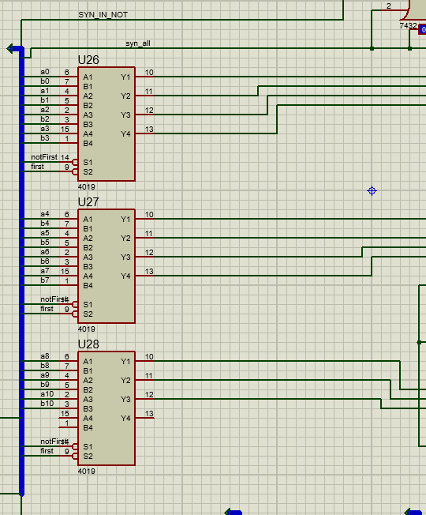

___
Для начала поясним идею реализации. Главная идея заключается в разложении exp(x) в ряд Тейлора. Ряд имеет следующий вид:
```
exp(x) = 1 + x + (x^2/2!) + (x^3/3!) + ...
```
То есть логика реализации осталось такой же, которая и была использована в прошлый раз, однако в данном случае необходимо было реализовать основные операции для чисел с плавающей точкой, в данной реализации нам потребуется умножение, факторизация, деление и сумма. После описания всех блоков опишем общую схему работы
Для каждого блока будем отдельно рассматривать и пояснять его логику работы... почти для каждого

## Умножение
В качестве умножения был реализован блок MUL, опишем его логику работы


* В самом начале схемы умножения высчитывается сумма экспонент, после которой необходимо вычесть 01111 для корректировки его значения, это необходимо в связи с тем, что на вход подаются не просто экспоненты, а экспоненты + 15(01111)


* После вычисления разности экспонент сдвигаем одно из чисел(в данной реализации сдвигается мантисса числа b), пока мы не получим значимую часть , то есть пока первый бит не станет 1, параллельно подсчитывая количество сдвигов, для дальнейшего использования


* Полученное значение умножаем на второе значение (точнее его мантиссу) как обычные двоичные числа, это реализуется с помощью записи мантиссы второго числа в счетчик, мантиссу перового в накапливающий сумматор, суммируем значение мантиссы первого ровно до того момента, пока на счетчике не станут все 0, это и будет останавливающим сигналом работы накапливающего сумматора 


* После вычисления суммы получаем результат, однако он может быть не нормализованным, нам необходимо проверять, нормализован он или нет, для этого как раз используем знание количества сдвинутых бит, точнее нам необходимо понять длину  второго числа, и зная длину первого числа мы можем подать на дешифратор значение их сумм на 1 больше и проверить какой там бит, если там единица, то произошло переполнение - нормализуем, если там ноль - число уже нормализовано


  
* После получения знания нормализованное значение или нет, просто с помощью мультиплексора выводим необходимое значение числа


* P.S: в нашей реализации используется одна особенность, у блока есть входной и выходной синхронизирующие биты, это необходимо для корректной его работы в цикле подсчетов. Работает это примерно следующим образом: когда на синхронизирующий вход подается фронт 01, значения в блоке очищаются и при спаде 10 происходит новая итерация подсчета с входными данными, которые сейчас приходят, на синхронизирующем выходе во время работы выводится 0, после подсчета с небольшой задержкой выводится 1 (информация что блок посчитал)

Демонстрация работы блока отдельно (подсчет степени числа 5)


В конце получает на регистрах DEG получаем число 0110000011100010 = 625


## Факторизация
В блоке факторизации необходимо было реализовать преобразователь чисел из обычного двоичного вида в вид с плавающей точкой. Для этого был реализован блок Converter.


* На вход данного блока приходит обычное двоичное число, на выходе получаем число с плавающей точкой (16 разрядное)
  
* В начале числа загружаются на сдвигающие регистры, которые сдвигают полученное число пока последнее число не 1, то есть все оставшиеся разряды будут являться мантиссой выходного числа, для этой проверки строится каскад ИЛИ, проверяющих и говорящих, что число посчиталось


  
* Сверху подсчитывается экспонента с помощью счетчиков к которой потом добавляется 01111 - 15 для нормализации экспоненты в виде числа с плавающей точкой.


  
* В данном блоке также как и в блоке Умножения есть входные и выходные разряды синхронизации, работают данные блоки по аналогии, второй раз описывать не будем

Демонстрация работы подсчета факториала до 5!


В конце на регистрах Fact получаем результат:
5! = 120, а мы получили число 0101011110000000 которое равно как раз 120


## Сумма
В данном блоке была реализована сумма чисел с плавающей точкой, которая полностью отличается от реализации на семинаре (так как мы подумали, что так будет нечестно)
Хотя логика работы примерно такая же, но главное же реализация...


* В самом начале сравниваем экспоненты и говорим, какая больше, так как нам необходимо привести два числа к одной экспоненте


* также вычисляем разность двух экспонент и приводим разность к положительному числу, например если экспонента числа А является большей экспоненты В, то получим положительное число, однако если она меньше, то нам необходимо преобразовать получившееся отрицательное число до положительного, так как нам его необходимо будет записать в сдвиговый регистр и нормализировать число 


  
* С помощью мультиплексоров выбираем число которое необходимо сдвинуть, то у которого меньшая экспонента



* После выбора необходимо сдвинуть это число на разность экспонент, подсчитанную ранее, это значение мы записываем на счетчик и с помощью сдвигового регистра сдвигаем значение, остановкой является 00000 на счетчиках, то есть это говорит о том, что число сдвинулось на необходимое значение


  
* После сдвига необходимо сложить числа как простые числа в двоичном представлении, данная сумма также как в умножении может быть ненормализованной, поэтому мы просто это должны проверить, это делается по аналогии, однако мы знаем точное положение переполнения в отличии от умножения, просто проверяем чему равен 12 бит, если 0, то переполнения не было, если 1 - переполнение было, нормализуем, все это делается с помощью мультиплексора в конце


  
* Также как и в других блок присутствуют входные и выходные разряды синхронизации, работающие по аналогии

Демонстрация работы блока к примеру сложение чисел 129.57 + 20.40


На выходе получаем значение 0101100010110000 = 150, что с определенной точностью равняется сумме данных двух чисел


# Общая работа схемы
Итак, все необходимые элементы у нас имеются для реализации самого алгоритма подсчета. Есть еще блок деления, но так как он не реализован до конца, рассматривать его нет смысла.

В общем, первая часть схемы включает в себя два, параллельно работающих блока - подсчет степени заданного числа на каждом шаге и подсчет соответствующего факториала для степени.

Блок подсчета степени:


С двух сторон блок умножения ограниченн регистрами, слева - регистры, хранящие входные данные, справа - регистры, записывающие результат каждого последующего умножения. При этом необходимо задать начальные условия на регистры справа, чтобы умножить число на 1 и на первом шаге записать его в эти регистры. Это достигается за счет мультиплексоров, которые в самом начале работы выдают на регистры сигналы, соответствующие 1. Затем просто каждое последующие умножение числа на его степень записывается в выходные регистры и снова подается на блок умножения.

Аналогично и с блоком подсчета факториала:


Есть счетчик, который на каждом шаге увеличивает число, на которое будет производиться умножение, на единицу. Затем это целое значение подается на конвертер, затем опять на регистры и с них уже снимается на блоке умножения. Тоже через мультиплексоры задаются начальные условия и происходит умножение предыдущего факториала на новое значение.

У блока умноженя есть выходной сигнал `syn_out`, который сообщает о том, что операция посчитана. С помощью этого сигнала значения записываются на выходные регистры, но еще с помощью этого сигнала должны тактироваться следующие элементы схемы.

Блок деления начинает работу после прихода сигнала от блоков подсчета степени и подсчета факториала. Затем с регистров снимаются посчитанные значения и подаются на блок деления.


От блока деления опять же результат поступает на следующие регистры. Есть еще небольшая часть выше - проверка на остановку работы схемы. Если мантиса меньше значения 00111, то смысла считать дальше нет, так как результат не принесет пользу в уже посчитанную точность (до 1 знака после запятой)

После прекращения работы от блока деления сигнал поступает на блок суммы и складывает полученное значение с предыдущем. Последние регистры хранят результаты всех сложений и после окончания работы с него снимается конечный результат.


## Подведение итогов
Можно сказать, что по отдельности все реализовать получилось, даже удалось некоторые части синхронизировать. Работает параллельно подсчет степени и факториала, что является несомненным успехом. Но в силу того, что не получилось до конца доделать блок деления, полную работу схемы проверить не удалось, что является несомненным провалом. Тем не менее, логика работы всех элементов схемы продумана, поэтому, если немного поработать над делением, то в итоге, можно получить, не побоюсь это слова, ПОЛНОСТЬЮ рабочую схему, которая считает степень экспоненты. В любом случае это было увлекательно путешествие, которое в скором времени продолжится уже в следующем семестре. До встречи!)
